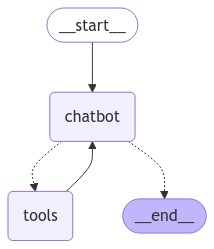

# LangGraph-Bielik
Example of LangGraph agent with Tavily Search API tool with Bielik LLM model.



The main goal was to force Bielik model to use tools as it not supports function calling feature natively - llm.bind_tools() doesn't work.

The first step is to define a tool (function) TavilyRunQuery() based on standard Langchain's TavilySearchResults() library.
```
@tool
def TavilyRunQuery(query: str) -> str:
    """
    This function will run a query in TavilySearch and return the search result.
    """
    tool = TavilySearchResults(max_results=1)
    return tool.invoke(query)

tools = [TavilyRunQuery]
```

The next step is to render the created tool with special prompt:
```
rendered_tools = render_text_description(tools)

system_prompt = f"""\
You are an assistant that has access to the following set of tools. 
Here are the names and descriptions for each tool:

{rendered_tools}

Given the user input, return the name and input of the tool to use. 
Return your response as a JSON blob with 'name' and 'arguments' keys.

The `arguments` should be a dictionary, with keys corresponding to the argument names and the values corresponding to the requested values.
"""

prompt = ChatPromptTemplate.from_messages(
    [("system", system_prompt), ("user", "{input}")]
)
```

The result is the output with a name of a function and arguments:
```
{'name': 'TavilyRunQuery',
 'arguments': {'query': 'Co wiesz na temat polskiego modelu językowego Bielik?'}}
```

The last part is to define a special parser:
```
def parse_output(output: Dict) -> Dict:
    role = "assistant"
    text = output["output"]["content"]
    url = output["output"]["url"]
    
    content = f"{text} \n You can find more information at: {url}"
    return {"role": role, "content": content}
```

and we have a complete chain:
```
chain = prompt | llm | JsonOutputParser() | RunnablePassthrough.assign(output=invoke_tool) | parse_output
```

which will be used in our LangGraph agent.

The parser role is to provide output as the following one with "role" and "content" keys:

```
{'role': 'assistant',
 'content': 'O Bieliku, polskim modelu językowym, w czym może pomóc edukatorom osób dorosłych. Bielik — pierwszy program LLM (Large Language Model) w pełni dostosowany do języka polskiego. Trochę o nim samym i możliwościach wykorzystania. Lidia Mirowska. \n You can find more information at: https://epale.ec.europa.eu/pl/blog/o-bieliku-polskim-modelu-jezykowym-w-czym-moze-pomoc-edukatorom-osob-doroslych'}
```

Bielik served by Ollama.
